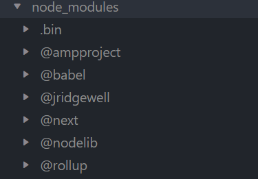

# メモ

備忘録として

## typescript

次のコマンドでTypeScriptのプラグイン(next js)をインストール

~~~shell
npm install next-pwa
~~~

こんな感じのディレクトリが作られる

## jQuery

TypeScriptでjQueryを使うには、jQueryの型情報を追加する必要がある
例えば、jQueryはもともとJavaScript用のライブラリなので、TypeScript用の型情報は提供していない
、次のように自力で型情報を付けることで、TypeScriptコードから利用できるようになる。
（実際には、DefinitelyTypedプロジェクトが提供する@types/jqueryを使用するのが簡単）

~~~shell
npm install --save-dev @types/jquery
~~~

~~~TypeScript
import * as $ from 'jquery'; //インポート
~~~

> 参考 <https://www.commte.co.jp/learn-nextjs/PWA>

## phpへのPOST

JavaScriptでファイルに書き込むには、**ブラウザのセキュリティ上の制限がある**ため、直接ファイルに書き込むことはできない。
ただし、ブラウザのダウンロード機能を利用して、ユーザーがダウンロードしたファイルに書き込むことは可能である。

Node.jsのfsモジュールを使用する場合、サーバーサイドでファイルに書き込むことができる。一方、Ajaxを使用する場合、クライアントサイドからサーバーサイドにリクエストを送信し、サーバーサイドでファイルに書き込むことができる。

**どちらが良いかは、どのような状況で使用するかによって異なる。**

### Ajax

Ajaxを使用する場合、クライアントサイドからサーバーサイドにリクエストを送信する為、セキュリティ上の問題が発生する可能性がある。
また、Ajaxを使用する場合、JavaScriptでファイルに直接書き込むことはできない。代わりに、サーバーサイドのスクリプトを使用してファイルに書き込む必要がある。

### Node.js

Node.jsのfsモジュールを使用する場合、サーバーサイドでファイルに直接書き込むことができる。これは、セキュリティ上の問題が発生しないためです。また、Node.jsのfsモジュールは非同期的に動作するため、処理速度が速くなる可能性がある。

### 結論

どちらが良いかは、どのような状況で使用するかによって異なる。
もし、クライアントサイドからファイルに書き込む必要がある場合は、Ajaxを使用する必要があり、サーバーサイドでファイルに直接書き込む必要がある場合は、Node.jsのfsモジュールを使用する必要がある

以下：Ajaxを用いたphpへのデータのpost方法

~~~javascript

jQuery.ajax({
    url: 'url', //参照url 例: './save.php'
    type: 'POST', //postかgetか
    data: data //postするデータ
})

~~~

## 504エラー

ajaxを用いてphpにデータを投げようとしたら
次のようなエラーが出た
`Failed to load resource: the server responded with a status of 405 (Method Not Allowed)`
