# TypeScript 環境構築

## 0. 必要なもの

+ Chrome
+ VScode

## 1. [Node.js](https://nodejs.org/ja)のサイトから18.16.0 LTS(推奨版)をダウンロードする

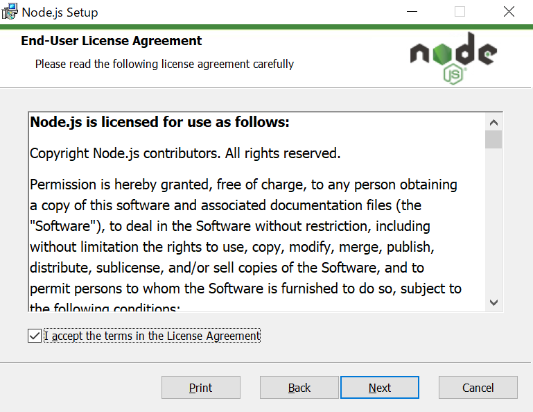
規約を読み、Nextを押す

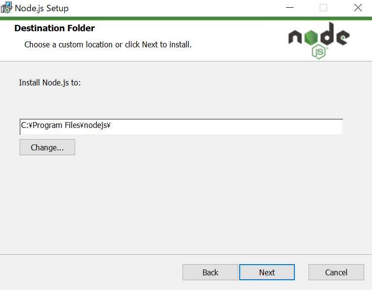

保存先のディレクトリを決める

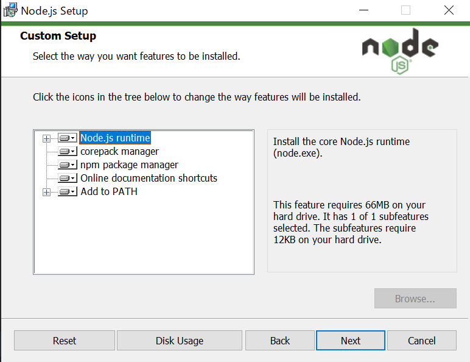

デフォルトのままで

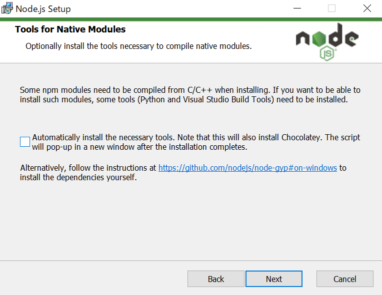

ここはチェックを外す

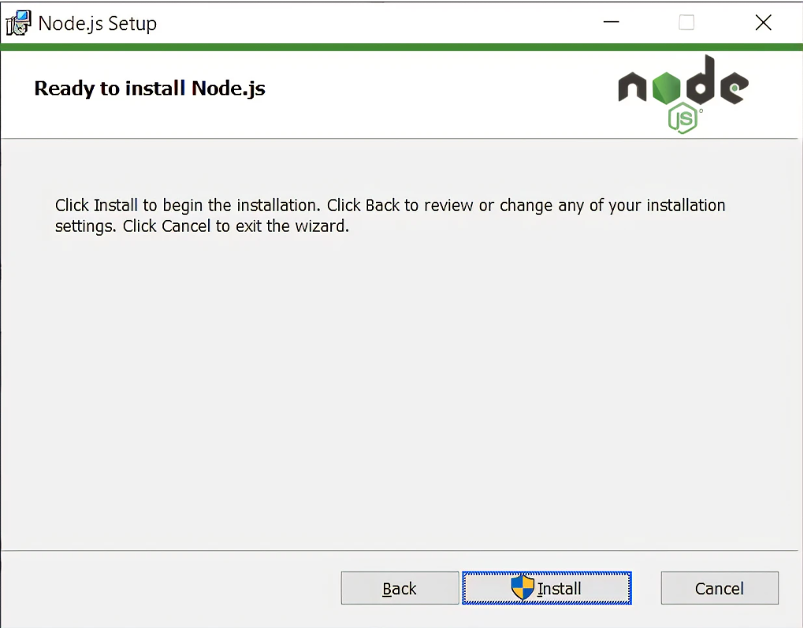

インストールを実行

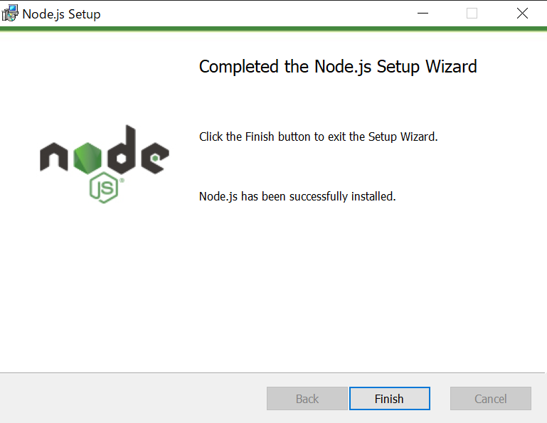

finish を押して終了

cmdで次のコマンドを打つ

~~~shell
node --version
~~~

`18.16.0`と出てきたら完了

## 2.TypeScriptコンパイラをインストール

cmdを開き、以下のコマンドを実行

~~~shell
npm install -g typescript
~~~

環境によっては`sudo`をつけて管理者権限の元インストール

~~~shell
sudo npm install -g typescript
~~~

### 2.1. VScodeの拡張機能をインストール

次の2つが入っていない場合、インストールする

[Javascript Debugger](https://marketplace.visualstudio.com/items?itemName=ms-vscode.js-debug)

[Live Server](https://marketplace.visualstudio.com/items?itemName=ritwickdey.LiveServer)

## 3.確認

以下のコマンドを実行して、バージョン名が出てきたら成功

~~~shell
tsc -v
~~~

## 4.ファイル確認

作業フォルダを作成して、VSCodeで開きます。(今回はユーザーフォルダー直下に`typescript`というフォルダー名で作成します)
VSCodeで、**ターミナル**タブ - **新しいターミナル**でターミナルを開きます。（作成したフォルダがカレントディレクトリになっています）
以下を実行します。

~~~shell
npm init -y
~~~

~~~shell
tsc --init
~~~

### 4.1.tscが実装できないときの対処法

PowerShellで

~~~shell
 Get-ExecutionPolicy
~~~

とコマンドを打つ

`Restricted`と表示されたら、実行ポリシーが初期値のままなので、
管理者権限でpowershellを開き、

~~~shell
Set-ExecutionPolicy RemoteSigned
~~~

と入力。実行ポリシー変更の画面が表示されるので`Y`と入力

そしてもう一度

~~~shell
tsc --init
~~~

下のような画面になったら成功！

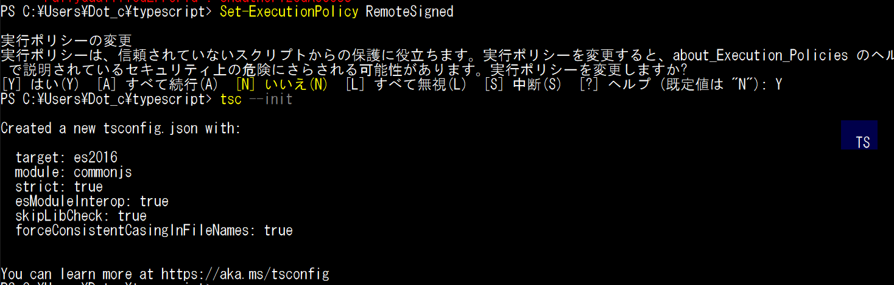

## 5. jsonの設定

4.で作成した`tsconfig.json`を設定

`tsconfig.json`を開き、以下のコードをコピペ

~~~json
{
  "compilerOptions": {
    /* Basic Options */
    "target": "ES6",
    "module": "ES2015",
    "sourceMap": true,
    "outDir": "./dist",
    "rootDir": "./src",
    "removeComments": true,
    "noEmitOnError": true,

    /* Strict Type-Checking Options */
    "strict": true,

    /* Additional Checks */
    "noUnusedLocals": true,
    "noUnusedParameters": true,
    "noImplicitReturns": true,

    /* Module Resolution Options */
    "esModuleInterop": true,

    /* Experimental Options */
    "experimentalDecorators": true,

    /* Advanced Options */
    "skipLibCheck": true,
    "forceConsistentCasingInFileNames": true
  }
}
~~~

**特に、`"target": "ES6"`、`"module": "ES2015"`、`"sourceMap": true`であることに注意**
**後述するESモジュールを使用するためには、ES2015（ES6）以降を指定する必要があるため**

`tsconfig.json`で、`"rootDir": "./src"`としたのでsrcフォルダのTypeScriptファイルをコンパイルする。

## 6. フォルダー構造

4.で作った`typescript`というフォルダーの中に`src`という名前でフォルダーを作って、その中に次のコードを`Hello.ts`と名前をつけて保存

`src/Hello.ts`

~~~typescript
const messege : String = "Hello World";
console.log(messege);
~~~

また、`typescript`のフォルダーの中に`index.html`を作成

`index.hdml`

~~~html
<!DOCTYPE html>
<html lang="ja">
    <head>
        <meta charset="UTF-8" />
        <meta http-equiv="X-UA-Compatible" content="IE=edge" />
        <meta name="viewport" content="width=device-width, initial-scale=1.0" />
        <!-- コンパイル後の名前を記入 -->
        
        <title>Document</title>
    </head>
    <body>
        
Example

    </body>
</html>
~~~

以下のようなフォルダー構造になればOK

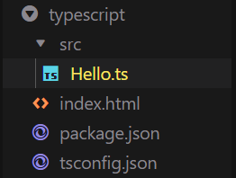

## 7. コンパイル

ターミナルで以下のコマンドを実行

~~~shell
tsc
~~~

そうすると、`dist`フォルダ内に、`Hello.js`、`Hello.js.map`が作成される。

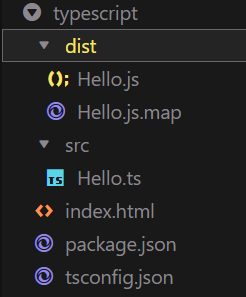

`Hello.js.map`は、デバッグ時に使用するファイルで、コンパイルされたjsファイルと元のtsファイルのコード位置を紐づけるファイル

## 8. コンパイル

**[実行とデバッグ]メニュー** -> **[launch.jsonファイルを作成]** -> **typescript を選択**

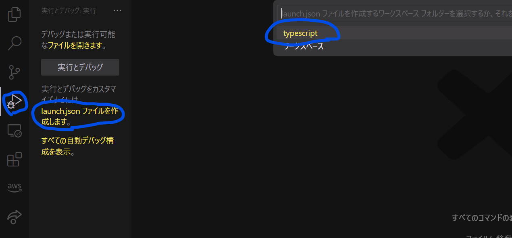

デバッガー選択画面が現れると思うので**Webアプリ(Chrome)**を選択

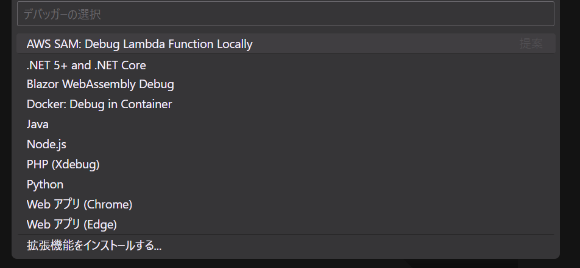

`typescript`フォルダー内に`.vscode`というフォルダーができ、その中に`launch.json`というファイルが作成されていたら成功！

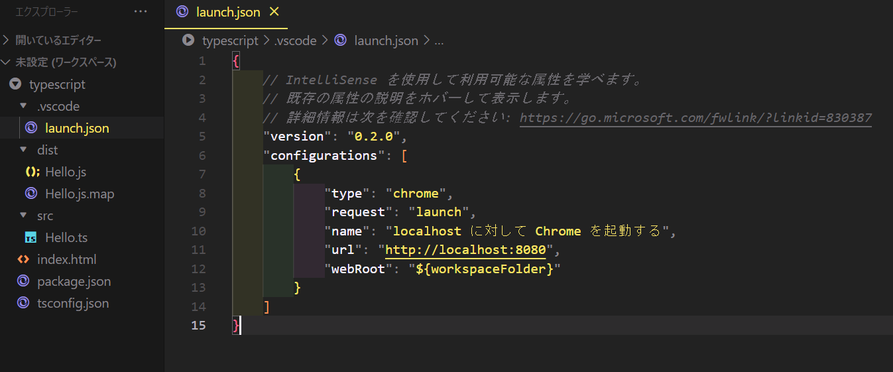

`launch.json`内のlocalhostのポート番号を`5500`に変更

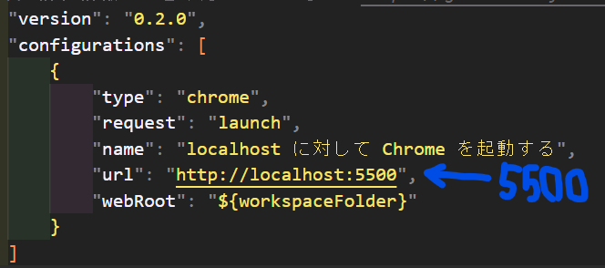

**VScode**右下にあるGo liveをクリック

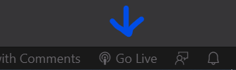

`port:5500`と表示されたら成功。できなかった場合もう一度`launch.json`の中身が間違っていないかチェック

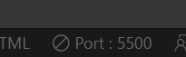

**Chrome**を開き、`http://localhost:5500/`にアクセス

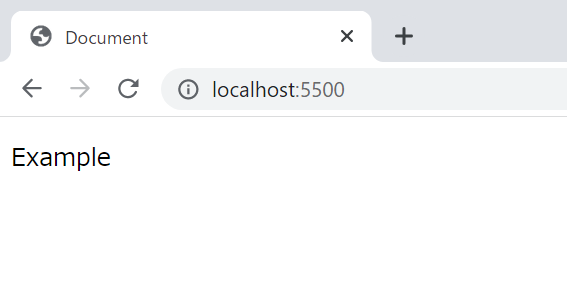

`F12`→`コンソール`タブをクリックし以下のようなコンソールがでていたらOK!
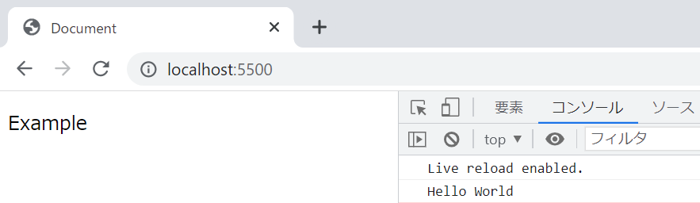

### 8.2. 再コンパイル

`Hello.ts`に以下のコードをコピペする

~~~typescript
const messege : String = "Hello World";
console.log(messege);
// 追加
for (let i = 0; i < 5; i++) {
    console.log(i + "Hello Typescript");
}
~~~

保存したらターミナルに`tsc`コマンドを打ってビルドすると、
chromeが更新されコンソールは次のような感じになっているはず

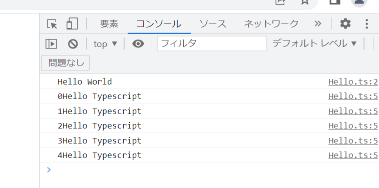

### 8.2.1 watchモード

ターミナルに次のコマンドを実行すると、ファイル保存時に自動的に再コンパイルされるようになる

~~~shell
tsc -w
~~~

終了する時は`Ctrl+C`
